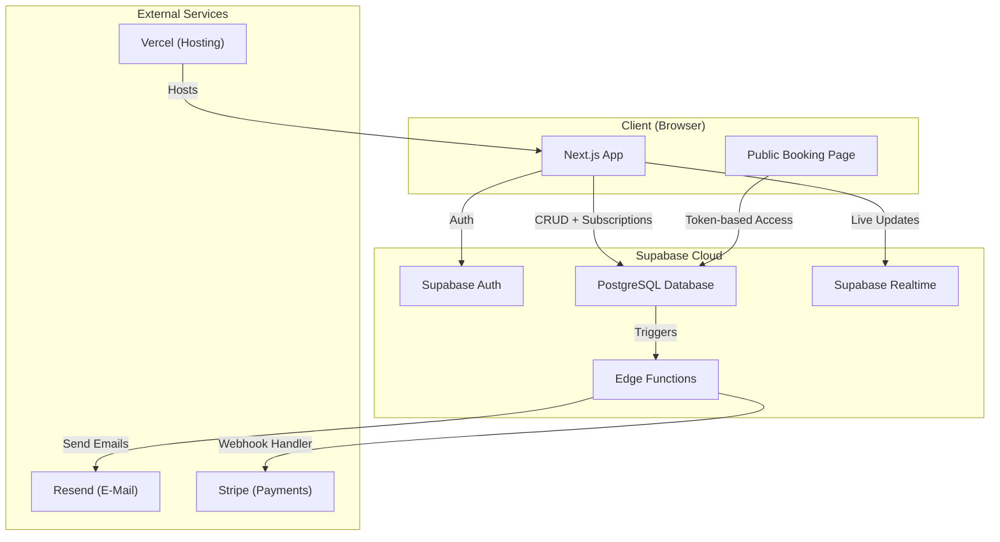

# PRD — SlotDock

## 1. Overview

### Product Summary

**SlotDock** — "SlotDock ist die Online-Rampenbuchung für Fulfillment-Unternehmen — Spediteure reservieren Zeitfenster selbst, das Lager plant stressfrei."

SlotDock ist ein webbasiertes Slot-Buchungssystem für Lager-Rampen, das sich an kleine bis mittelgroße Fulfillment-Unternehmen richtet. Lagerbetreiber konfigurieren Rampen, Kapazitäten und Zeitregeln, Spediteure buchen über einen öffentlichen Weblink verfügbare Zeitfenster — ohne Login, ohne App. Das System verhindert Überbuchungen automatisch und zeigt dem Disponenten eine klare Tagesübersicht.

### Objective

Diese PRD spezifiziert das MVP von SlotDock wie in product-vision.md § Product Strategy definiert: Lager-Setup, Slot-Buchung per Weblink, automatische Überbuchungskontrolle, Tages-Dashboard und E-Mail-Benachrichtigungen. Ziel ist ein in 4 Wochen mit Claude Code baubares Produkt.

### Market Differentiation

Die technische Implementation muss drei Dinge liefern, um die Differenzierung zu erreichen: erstens eine Setup-Erfahrung unter 10 Minuten (kein Wizard mit 15 Schritten, sondern ein einziges Formular), zweitens einen Buchungsflow ohne Authentifizierung für Spediteure (Token-basierter öffentlicher Link), und drittens ein Dashboard, das die Tagesübersicht in unter 2 Sekunden lädt und auf einen Blick erfassbar ist.

### Magic Moment

"Der Disponent öffnet morgens sein Dashboard und sieht alle Anlieferungen des Tages sauber auf Rampen verteilt — ohne einen einzigen Anruf gemacht zu haben."

Technisch erfordert das: Echtzeit-Aktualisierung des Dashboards wenn neue Buchungen eingehen (Supabase Realtime), eine visuell klare Rampen-Zeitleiste ohne Scroll-Zwang für Standardansichten, und zuverlässige E-Mail-Benachrichtigungen, die Spediteure zur Nutzung motivieren.

### Success Criteria

- Time-to-Setup: Neues Lager mit 3 Rampen in unter 5 Minuten konfiguriert
- Time-to-Book: Spediteur schließt eine Buchung in unter 60 Sekunden ab
- Page Load: Dashboard < 2s (LCP) auf 4G-Verbindung
- Überbuchungsschutz: 0% Doppelbuchungen bei gleichzeitigen Anfragen (Database-Level Constraint)
- E-Mail-Zustellung: Buchungsbestätigungen innerhalb von 30 Sekunden
- Alle P0-Features funktional und getestet

---

## 2. Technical Architecture

### Architecture Overview



### Chosen Stack

| Layer | Choice | Rationale |
|-------|--------|-----------|
| Frontend | Next.js | Größtes Ökosystem, beste Integration mit AI-Coding-Tools, riesige Community |
| Backend | Supabase | Open-Source Backend mit managed PostgreSQL, Auth, Realtime und Storage. Flexibel für SaaS und Einmalkauf |
| Database | PostgreSQL (via Supabase) | Industriestandard, inklusive bei Supabase, perfekt für relationale Daten |
| Auth | Supabase Auth | Direkt integriert, zero Config, Social Login, Magic Links, E-Mail/Passwort |
| Payments | Stripe | Industriestandard, größtes Ökosystem, Subscriptions und Einmalkäufe |

### Stack Integration Guide

**Setup-Reihenfolge:**

1. Supabase-Projekt erstellen (supabase.com), Projekt-URL und API-Keys notieren
2. Next.js-Projekt mit `create-next-app` initialisieren (App Router, TypeScript, Tailwind)
3. `@supabase/supabase-js` und `@supabase/ssr` installieren
4. Supabase-Client konfigurieren (Browser-Client und Server-Client)
5. Supabase Auth Middleware in Next.js einrichten für geschützte Routen
6. Datenbank-Schema via Supabase Migrations erstellen
7. Row Level Security (RLS) Policies definieren
8. Stripe-Account einrichten, API-Keys konfigurieren
9. Resend-Account für E-Mails einrichten

**Bekannte Integrationsmuster:**

- Supabase Client wird in Next.js über zwei Varianten genutzt: `createBrowserClient()` für Client Components und `createServerClient()` für Server Components / Route Handlers / Middleware
- Supabase Realtime erfordert, dass RLS-Policies für `SELECT` korrekt konfiguriert sind, damit Subscriptions funktionieren
- Stripe Webhooks werden über Next.js API Routes (`/api/webhooks/stripe`) empfangen
- E-Mail-Versand erfolgt über Supabase Edge Functions oder Next.js API Routes mit Resend SDK

**Häufige Fallstricke:**

- Supabase Auth Middleware muss in `middleware.ts` im Projekt-Root liegen, nicht im `src/`-Ordner
- RLS-Policies vergessen = kein Datenzugriff trotz korrekter Abfragen
- Supabase Realtime-Subscriptions brauchen `REPLICA IDENTITY FULL` auf Tabellen, um alte und neue Werte zu erhalten
- Stripe Webhook-Signatur-Verifizierung erfordert den Raw Body — Next.js App Router Route Handlers liefern den Body standardmäßig nicht als Raw Buffer

**Environment Variables:**

```
NEXT_PUBLIC_SUPABASE_URL=https://xxx.supabase.co
NEXT_PUBLIC_SUPABASE_ANON_KEY=eyJ...
SUPABASE_SERVICE_ROLE_KEY=eyJ...
STRIPE_SECRET_KEY=sk_...
STRIPE_WEBHOOK_SECRET=whsec_...
NEXT_PUBLIC_STRIPE_PUBLISHABLE_KEY=pk_...
RESEND_API_KEY=re_...
NEXT_PUBLIC_APP_URL=https://app.slotdock.de
```

### Repository Structure

```
slotdock/
├── src/
│   ├── app/
│   │   ├── (auth)/
│   │   │   ├── login/page.tsx          # Login-Seite
│   │   │   ├── signup/page.tsx         # Registrierung
│   │   │   └── callback/route.ts       # Auth Callback
│   │   ├── (dashboard)/
│   │   │   ├── layout.tsx              # Dashboard-Layout mit Sidebar
│   │   │   ├── page.tsx                # Tages-Dashboard (Startseite)
│   │   │   ├── warehouse/
│   │   │   │   └── setup/page.tsx      # Lager-Setup
│   │   │   ├── docks/page.tsx          # Rampenverwaltung
│   │   │   ├── bookings/page.tsx       # Buchungsübersicht
│   │   │   └── settings/page.tsx       # Kontoeinstellungen
│   │   ├── (public)/
│   │   │   └── book/
│   │   │       └── [token]/page.tsx    # Öffentliche Buchungsseite
│   │   ├── api/
│   │   │   ├── webhooks/
│   │   │   │   └── stripe/route.ts     # Stripe Webhooks
│   │   │   └── email/
│   │   │       └── send/route.ts       # E-Mail-Versand
│   │   ├── layout.tsx                  # Root Layout
│   │   └── page.tsx                    # Landing Page
│   ├── components/
│   │   ├── ui/                         # Design System Primitives
│   │   │   ├── button.tsx
│   │   │   ├── card.tsx
│   │   │   ├── input.tsx
│   │   │   ├── select.tsx
│   │   │   ├── modal.tsx
│   │   │   ├── badge.tsx
│   │   │   ├── skeleton.tsx
│   │   │   └── toast.tsx
│   │   ├── features/
│   │   │   ├── dashboard/
│   │   │   │   ├── day-view.tsx        # Tagesansicht mit Rampen-Zeitleiste
│   │   │   │   ├── dock-timeline.tsx   # Einzelne Rampen-Zeitleiste
│   │   │   │   ├── booking-card.tsx    # Buchungskarte in der Zeitleiste
│   │   │   │   └── stats-bar.tsx       # Tagesstatistiken
│   │   │   ├── warehouse/
│   │   │   │   ├── warehouse-form.tsx  # Lager-Setup-Formular
│   │   │   │   └── dock-form.tsx       # Rampen-Formular
│   │   │   ├── booking/
│   │   │   │   ├── public-calendar.tsx # Öffentlicher Buchungskalender
│   │   │   │   ├── slot-picker.tsx     # Slot-Auswahl
│   │   │   │   └── booking-form.tsx    # Buchungsformular
│   │   │   └── auth/
│   │   │       ├── login-form.tsx
│   │   │       └── signup-form.tsx
│   │   └── layout/
│   │       ├── sidebar.tsx
│   │       ├── header.tsx
│   │       └── nav-item.tsx
│   ├── lib/
│   │   ├── supabase/
│   │   │   ├── client.ts              # Browser Supabase Client
│   │   │   ├── server.ts              # Server Supabase Client
│   │   │   └── middleware.ts           # Auth Middleware Helper
│   │   ├── stripe/
│   │   │   └── client.ts              # Stripe Client Setup
│   │   ├── email/
│   │   │   └── templates.ts           # E-Mail Templates
│   │   ├── utils.ts                   # Hilfsfunktionen
│   │   ├── constants.ts               # App-weite Konstanten
│   │   └── types.ts                   # TypeScript Typen
│   └── hooks/
│       ├── use-warehouse.ts           # Lager-Daten
│       ├── use-bookings.ts            # Buchungs-Daten mit Realtime
│       └── use-docks.ts               # Rampen-Daten
├── supabase/
│   ├── migrations/                    # Datenbank-Migrationen
│   │   └── 001_initial_schema.sql
│   ├── seed.sql                       # Testdaten
│   └── config.toml                    # Supabase CLI Config
├── public/
│   └── logo.svg
├── middleware.ts                       # Next.js Auth Middleware
├── tailwind.config.ts
├── next.config.ts
├── tsconfig.json
├── package.json
└── .env.local
```

### Infrastructure & Deployment

**Hosting:** Vercel (Free Tier). Next.js ist ein First-Class Citizen auf Vercel — Zero Config Deployment, automatische Previews für Branches, Edge Functions für Middleware.

**Backend:** Supabase Cloud (Free Tier). Managed PostgreSQL, Auth, Realtime, Edge Functions. Deployment über Supabase CLI für Migrationen.

**E-Mail:** Resend (Free Tier: 100 Emails/Tag, 3000/Monat). Für den MVP ausreichend. Alternative bei Skalierung: Supabase Edge Functions + SMTP.

**CI/CD:** Vercel automatisches Deployment bei Push auf `main`. Supabase Migrationen werden lokal via `supabase db push` ausgeführt oder über GitHub Actions automatisiert.

**Domain:** Eigene Domain (z.B. slotdock.de) auf Vercel konfigurieren. DNS-Setup über den Domain-Provider.

### Security Considerations

**Authentifizierung:** Supabase Auth mit E-Mail/Passwort für Lagerbetreiber. JWT-Tokens werden in HTTP-only Cookies gespeichert (via `@supabase/ssr`). Token-Refresh passiert automatisch über die Middleware.

**Öffentliche Buchungsseite:** Token-basierter Zugang. Jedes Lager erhält einen einzigartigen Buchungs-Token (UUID v4). Dieser Token gewährt nur Lese-Zugriff auf verfügbare Slots und Schreib-Zugriff auf Buchungserstellung — keine anderen Daten. Der Token kann vom Lagerbetreiber jederzeit regeneriert werden.

**Row Level Security (RLS):** Jede Tabelle hat RLS aktiviert. Lagerbetreiber sehen nur ihre eigenen Daten. Die öffentliche Buchungsseite nutzt den Anon-Key mit speziellen RLS-Policies, die nur über den Booking-Token filtern.

**Input Validation:** Doppelte Validierung — Client-seitig mit zod für sofortiges Feedback, Server-seitig in API Routes und via PostgreSQL Constraints. Slot-Buchungen werden über eine PostgreSQL-Transaktion mit `SELECT ... FOR UPDATE` abgesichert, um Race Conditions bei gleichzeitigen Buchungen zu verhindern.

**DSGVO:** Minimale Datenerhebung. Spediteur-Daten (Firma, Kennzeichen, Referenznummer) werden nur für die Buchung gespeichert. Datenschutzerklärung auf der Buchungsseite. Supabase-Projekt in EU-Region (Frankfurt) erstellen.

### Cost Estimate

| Service | Free Tier | Grenze | Geschätzte Kosten Monat 1–6 |
|---------|-----------|--------|------------------------------|
| Supabase | Ja | 500 MB DB, 2 Projekte, 50k MAU | 0€ (Free Tier reicht) |
| Vercel | Ja | 100 GB Bandwidth, Serverless Functions | 0€ (Free Tier reicht) |
| Resend | Ja | 100 Emails/Tag, 3000/Monat | 0€ (Free Tier, bei Skalierung ~20$/Monat) |
| Stripe | Nein | Pay per transaction | 1,5% + 0,25€ pro Transaktion |
| Domain | Nein | — | ~12€/Jahr (~1€/Monat) |
| **Gesamt** | | | **~1€/Monat + Stripe-Gebühren** |

---

## 3. Data Model

### Entity Definitions

```sql
-- Benutzer-Profil (ergänzt Supabase Auth users)
CREATE TABLE profiles (
  id UUID PRIMARY KEY REFERENCES auth.users(id) ON DELETE CASCADE,
  full_name VARCHAR(255) NOT NULL,
  email VARCHAR(255) NOT NULL,
  company_name VARCHAR(255),
  phone VARCHAR(50),
  created_at TIMESTAMPTZ DEFAULT NOW(),
  updated_at TIMESTAMPTZ DEFAULT NOW()
);

-- Lager
CREATE TABLE warehouses (
  id UUID PRIMARY KEY DEFAULT gen_random_uuid(),
  owner_id UUID NOT NULL REFERENCES profiles(id) ON DELETE CASCADE,
  name VARCHAR(255) NOT NULL,
  address_street VARCHAR(255),
  address_city VARCHAR(255),
  address_zip VARCHAR(20),
  address_country VARCHAR(100) DEFAULT 'Deutschland',
  opening_time TIME NOT NULL DEFAULT '07:00',
  closing_time TIME NOT NULL DEFAULT '17:00',
  timezone VARCHAR(50) NOT NULL DEFAULT 'Europe/Berlin',
  booking_token UUID NOT NULL DEFAULT gen_random_uuid(),
  default_slot_duration_minutes INTEGER NOT NULL DEFAULT 45,
  max_advance_booking_days INTEGER NOT NULL DEFAULT 14,
  created_at TIMESTAMPTZ DEFAULT NOW(),
  updated_at TIMESTAMPTZ DEFAULT NOW()
);

-- Rampen
CREATE TABLE docks (
  id UUID PRIMARY KEY DEFAULT gen_random_uuid(),
  warehouse_id UUID NOT NULL REFERENCES warehouses(id) ON DELETE CASCADE,
  name VARCHAR(100) NOT NULL,
  dock_type VARCHAR(50) NOT NULL DEFAULT 'general',
  max_concurrent INTEGER NOT NULL DEFAULT 1,
  is_active BOOLEAN NOT NULL DEFAULT true,
  sort_order INTEGER NOT NULL DEFAULT 0,
  created_at TIMESTAMPTZ DEFAULT NOW(),
  updated_at TIMESTAMPTZ DEFAULT NOW(),
  UNIQUE(warehouse_id, name)
);

-- Zeitfenster-Regeln (optionale Überschreibungen pro Rampe)
CREATE TABLE dock_schedules (
  id UUID PRIMARY KEY DEFAULT gen_random_uuid(),
  dock_id UUID NOT NULL REFERENCES docks(id) ON DELETE CASCADE,
  day_of_week INTEGER NOT NULL CHECK (day_of_week BETWEEN 0 AND 6),
  opening_time TIME NOT NULL,
  closing_time TIME NOT NULL,
  slot_duration_minutes INTEGER,
  is_closed BOOLEAN NOT NULL DEFAULT false,
  created_at TIMESTAMPTZ DEFAULT NOW(),
  UNIQUE(dock_id, day_of_week)
);

-- Buchungen
CREATE TABLE bookings (
  id UUID PRIMARY KEY DEFAULT gen_random_uuid(),
  warehouse_id UUID NOT NULL REFERENCES warehouses(id) ON DELETE CASCADE,
  dock_id UUID NOT NULL REFERENCES docks(id) ON DELETE CASCADE,
  slot_start TIMESTAMPTZ NOT NULL,
  slot_end TIMESTAMPTZ NOT NULL,
  status VARCHAR(50) NOT NULL DEFAULT 'confirmed'
    CHECK (status IN ('confirmed', 'arrived', 'completed', 'cancelled', 'no_show')),
  carrier_company VARCHAR(255) NOT NULL,
  carrier_contact_name VARCHAR(255),
  carrier_email VARCHAR(255),
  carrier_phone VARCHAR(50),
  license_plate VARCHAR(50),
  reference_number VARCHAR(255),
  notes TEXT,
  cancelled_at TIMESTAMPTZ,
  cancellation_reason TEXT,
  created_at TIMESTAMPTZ DEFAULT NOW(),
  updated_at TIMESTAMPTZ DEFAULT NOW()
);

-- Subscriptions (Stripe)
CREATE TABLE subscriptions (
  id UUID PRIMARY KEY DEFAULT gen_random_uuid(),
  profile_id UUID NOT NULL REFERENCES profiles(id) ON DELETE CASCADE,
  stripe_customer_id VARCHAR(255) NOT NULL,
  stripe_subscription_id VARCHAR(255) UNIQUE,
  plan VARCHAR(50) NOT NULL DEFAULT 'starter'
    CHECK (plan IN ('trial', 'starter', 'professional', 'business')),
  status VARCHAR(50) NOT NULL DEFAULT 'active'
    CHECK (status IN ('active', 'past_due', 'cancelled', 'trialing')),
  current_period_start TIMESTAMPTZ,
  current_period_end TIMESTAMPTZ,
  created_at TIMESTAMPTZ DEFAULT NOW(),
  updated_at TIMESTAMPTZ DEFAULT NOW()
);
```

### Relationships

- **profiles → warehouses:** 1:many. Ein Profil kann mehrere Lager besitzen (für spätere Multi-Standort-Erweiterung), MVP: ein Lager pro Profil.
- **warehouses → docks:** 1:many. Ein Lager hat 1–N Rampen. Cascade Delete: Lager löschen entfernt alle Rampen.
- **docks → dock_schedules:** 1:many. Eine Rampe hat optionale Tages-Überschreibungen (0–7). Cascade Delete.
- **warehouses → bookings:** 1:many. Ein Lager hat N Buchungen. Cascade Delete.
- **docks → bookings:** 1:many. Eine Rampe hat N Buchungen. Cascade Delete.
- **profiles → subscriptions:** 1:1. Ein Profil hat eine Subscription. Cascade Delete.

### Indexes

```sql
-- Buchungen pro Rampe und Zeitraum (Kernabfrage für Verfügbarkeitsprüfung)
CREATE INDEX idx_bookings_dock_time ON bookings(dock_id, slot_start, slot_end)
  WHERE status != 'cancelled';

-- Buchungen pro Lager und Tag (Dashboard-Tagesansicht)
CREATE INDEX idx_bookings_warehouse_date ON bookings(warehouse_id, slot_start)
  WHERE status != 'cancelled';

-- Lager nach Owner (Login → eigene Lager laden)
CREATE INDEX idx_warehouses_owner ON warehouses(owner_id);

-- Lager nach Booking-Token (öffentliche Buchungsseite)
CREATE UNIQUE INDEX idx_warehouses_token ON warehouses(booking_token);

-- Rampen nach Lager (Rampen eines Lagers laden)
CREATE INDEX idx_docks_warehouse ON docks(warehouse_id) WHERE is_active = true;

-- Subscription nach Profil
CREATE INDEX idx_subscriptions_profile ON subscriptions(profile_id);
```

---

## 4. API Specification

### API Design Philosophy

SlotDock nutzt Next.js Server Actions und API Routes in Kombination mit dem Supabase Client SDK. Authentifizierte Aktionen laufen über Server Actions (direkte Supabase-Abfragen mit dem Server-Client), öffentliche Aktionen (Buchung) über API Routes mit Token-Validierung.

**Error Response Format:**
```json
{
  "error": "SLOT_UNAVAILABLE",
  "message": "Das gewählte Zeitfenster ist nicht mehr verfügbar.",
  "details": {}
}
```

**Paginierung:** Offset-based mit `limit` und `offset` Parametern. Standard: `limit=50`.

### Endpoints

**Warehouses**

```
GET /api/warehouses
Auth: Required (Supabase JWT)
Response 200: { warehouses: Warehouse[] }
Note: Nur Lager des eingeloggten Users (RLS)

POST /api/warehouses
Auth: Required
Body: {
  name: string,
  address_street?: string,
  address_city?: string,
  address_zip?: string,
  opening_time: string,       // "07:00"
  closing_time: string,       // "17:00"
  default_slot_duration_minutes: number,
  max_advance_booking_days?: number
}
Response 201: { warehouse: Warehouse }
Response 400: { error: string, details: ValidationError[] }

PATCH /api/warehouses/[id]
Auth: Required (Owner only)
Body: Partial<WarehouseInput>
Response 200: { warehouse: Warehouse }

POST /api/warehouses/[id]/regenerate-token
Auth: Required (Owner only)
Response 200: { booking_token: string }
```

**Docks**

```
GET /api/warehouses/[warehouseId]/docks
Auth: Required (Owner only)
Response 200: { docks: Dock[] }

POST /api/warehouses/[warehouseId]/docks
Auth: Required (Owner only)
Body: {
  name: string,
  dock_type?: string,
  max_concurrent?: number
}
Response 201: { dock: Dock }

PATCH /api/docks/[id]
Auth: Required (Owner only)
Body: Partial<DockInput>
Response 200: { dock: Dock }

DELETE /api/docks/[id]
Auth: Required (Owner only)
Response 200: { success: true }
Response 409: { error: "DOCK_HAS_BOOKINGS", message: "Rampe hat aktive Buchungen" }
```

**Bookings (Authenticated — Dashboard)**

```
GET /api/warehouses/[warehouseId]/bookings
Auth: Required (Owner only)
Query: { date: string, dock_id?: string, status?: string }
Response 200: { bookings: Booking[] }

PATCH /api/bookings/[id]/status
Auth: Required (Owner only)
Body: { status: "arrived" | "completed" | "cancelled" | "no_show" }
Response 200: { booking: Booking }
```

**Bookings (Public — Spediteur-Buchung)**

```
GET /api/public/book/[token]/availability
Auth: None (Token-based)
Query: { date: string }
Response 200: {
  warehouse: { name: string, address: string },
  docks: { id: string, name: string }[],
  slots: {
    dock_id: string,
    start: string,        // ISO 8601
    end: string,
    available: boolean
  }[]
}
Response 404: { error: "INVALID_TOKEN" }

POST /api/public/book/[token]
Auth: None (Token-based)
Body: {
  dock_id: string,
  slot_start: string,     // ISO 8601
  carrier_company: string,
  carrier_contact_name?: string,
  carrier_email?: string,
  carrier_phone?: string,
  license_plate?: string,
  reference_number?: string,
  notes?: string
}
Response 201: { booking: PublicBooking, confirmation_code: string }
Response 409: { error: "SLOT_UNAVAILABLE" }
Response 400: { error: string, details: ValidationError[] }
```

**Stripe Webhooks**

```
POST /api/webhooks/stripe
Auth: Stripe Signature Verification
Events handled:
  - checkout.session.completed → Activate subscription
  - customer.subscription.updated → Update plan/status
  - customer.subscription.deleted → Mark cancelled
  - invoice.payment_failed → Mark past_due
```

---

## 5. User Stories

### Epic: Lager-Setup

**US-001: Lager erstellen**
Als Markus (Lagerbetreiber) möchte ich mein Lager mit Name, Adresse und Öffnungszeiten anlegen, damit ich mit der Rampenplanung beginnen kann.

Acceptance Criteria:
- [ ] Given ich bin eingeloggt, when ich das Lager-Formular ausfülle und speichere, then wird ein neues Lager erstellt und ich werde zum Rampen-Setup weitergeleitet
- [ ] Given ich lasse Pflichtfelder leer, when ich speichere, then sehe ich Validierungsfehler an den entsprechenden Feldern
- [ ] Given ich habe bereits ein Lager, when ich die Dashboard-Startseite öffne, then sehe ich mein bestehendes Lager

**US-002: Rampen verwalten**
Als Markus möchte ich Rampen zu meinem Lager hinzufügen und konfigurieren, damit Spediteure dort Slots buchen können.

Acceptance Criteria:
- [ ] Given ich bin im Lager-Setup, when ich eine Rampe hinzufüge mit Name und Typ, then erscheint sie in der Rampenliste
- [ ] Given ich habe eine Rampe, when ich sie deaktiviere, then wird sie nicht mehr in der Buchungsansicht angezeigt
- [ ] Given ich habe eine Rampe mit aktiven Buchungen, when ich sie lösche, then erhalte ich eine Warnung und die Löschung wird blockiert

**US-003: Buchungslink erhalten**
Als Markus möchte ich einen Buchungslink für mein Lager erhalten, damit ich ihn an Spediteure weitergeben kann.

Acceptance Criteria:
- [ ] Given mein Lager ist eingerichtet, when ich die Einstellungen öffne, then sehe ich den Buchungslink als kopierbaren Text
- [ ] Given ich möchte den Link erneuern, when ich auf "Neuen Link generieren" klicke, then wird ein neuer Token erstellt und der alte Link funktioniert nicht mehr

### Epic: Slot-Buchung (Spediteur)

**US-004: Verfügbare Slots einsehen**
Als Stefan (Spediteur) möchte ich über einen Link die verfügbaren Zeitfenster sehen, damit ich eine passende Anlieferzeit buchen kann.

Acceptance Criteria:
- [ ] Given ich öffne einen gültigen Buchungslink, when die Seite lädt, then sehe ich den Lagernamen und einen Kalender mit verfügbaren Tagen
- [ ] Given ich wähle einen Tag, when die Slots geladen sind, then sehe ich pro Rampe die freien und belegten Zeitfenster
- [ ] Given ein Slot ist belegt, when ich ihn ansehe, then ist er als nicht verfügbar markiert und nicht anklickbar
- [ ] Edge case: Ungültiger Token → Fehlerseite mit Hinweis "Dieser Buchungslink ist ungültig"

**US-005: Slot buchen**
Als Stefan möchte ich einen freien Slot in unter 60 Sekunden buchen, damit ich meine Anlieferung planen kann.

Acceptance Criteria:
- [ ] Given ich habe einen freien Slot gewählt, when ich Firma und optionale Angaben eingebe und bestätige, then wird die Buchung erstellt und ich sehe eine Bestätigungsseite
- [ ] Given ich buche, when ein anderer Spediteur denselben Slot gleichzeitig bucht, then erhält einer eine Fehlermeldung "Slot nicht mehr verfügbar"
- [ ] Given meine Buchung ist bestätigt, when die E-Mail-Zustellung aktiv ist, then erhalte ich eine Bestätigungsmail mit allen Details
- [ ] Edge case: Buchung in der Vergangenheit → nicht möglich, Fehlermeldung

### Epic: Dashboard (Disponent)

**US-006: Tagesübersicht anzeigen**
Als Markus möchte ich morgens auf einen Blick sehen, welche Anlieferungen heute an welcher Rampe geplant sind.

Acceptance Criteria:
- [ ] Given ich öffne das Dashboard, when Buchungen für heute existieren, then sehe ich eine Zeitleiste pro Rampe mit den gebuchten Slots
- [ ] Given ein Spediteur bucht einen neuen Slot, when ich das Dashboard geöffnet habe, then erscheint die neue Buchung in Echtzeit (Realtime)
- [ ] Given keine Buchungen existieren, when ich das Dashboard öffne, then sehe ich einen leeren Zustand mit Hinweis auf den Buchungslink
- [ ] Given ich möchte einen anderen Tag ansehen, when ich das Datum wechsle, then aktualisiert sich die Ansicht

**US-007: Buchungsstatus ändern**
Als Markus möchte ich den Status einer Buchung aktualisieren (angekommen, abgefertigt, nicht erschienen), damit mein Team den Überblick behält.

Acceptance Criteria:
- [ ] Given eine Buchung hat Status "confirmed", when ich auf "Angekommen" klicke, then ändert sich der Status auf "arrived" und die Farbe ändert sich
- [ ] Given eine Buchung hat Status "arrived", when ich auf "Abgefertigt" klicke, then ändert sich der Status auf "completed"
- [ ] Given eine Buchung, when ich auf "Stornieren" klicke, then werde ich nach dem Grund gefragt und der Status wird auf "cancelled" gesetzt

### Epic: Benachrichtigungen

**US-008: Buchungsbestätigung per E-Mail**
Als Stefan möchte ich nach der Buchung eine Bestätigungsmail erhalten, damit ich die Details griffbereit habe.

Acceptance Criteria:
- [ ] Given ich habe eine E-Mail-Adresse angegeben, when meine Buchung bestätigt ist, then erhalte ich innerhalb von 30 Sekunden eine E-Mail mit Lagername, Rampe, Datum, Uhrzeit und Referenznummer
- [ ] Given ich habe keine E-Mail angegeben, when ich buche, then wird keine E-Mail versendet, die Bestätigung erscheint nur auf der Webseite

**US-009: Neue-Buchung-Benachrichtigung für Disponent**
Als Markus möchte ich per E-Mail informiert werden, wenn ein Spediteur einen Slot bucht.

Acceptance Criteria:
- [ ] Given ein Spediteur bucht einen Slot, when die Buchung gespeichert ist, then erhalte ich eine E-Mail mit den Buchungsdetails
- [ ] Given ich möchte keine E-Mails, when ich die Benachrichtigungen in den Einstellungen deaktiviere, then werden keine E-Mails gesendet

---

## 6. Functional Requirements

### Lager-Verwaltung

**FR-001: Lager erstellen und bearbeiten**
Priority: P0
Description: Lagerbetreiber können ein Lager mit Name, Adresse, Öffnungszeiten, Standard-Slotlänge und maximaler Vorausbuchungsdauer erstellen und bearbeiten.
Acceptance Criteria:
- Pflichtfelder: Name, Öffnungszeit, Schließzeit
- Standard-Slotlänge: 15–240 Minuten, Default 45
- Vorausbuchungsdauer: 1–90 Tage, Default 14
- Validierung Client- und Server-seitig
Related Stories: US-001

**FR-002: Rampen erstellen und verwalten**
Priority: P0
Description: Lagerbetreiber können Rampen hinzufügen, bearbeiten, aktivieren/deaktivieren und löschen. Jede Rampe hat einen Namen, Typ und maximale gleichzeitige Belegung.
Acceptance Criteria:
- Rampenname eindeutig pro Lager
- Max Concurrent: 1–5, Default 1
- Löschen nur möglich wenn keine aktiven Buchungen existieren
- Deaktivierte Rampen erscheinen nicht in der Buchungsansicht
Related Stories: US-002

**FR-003: Buchungslink generieren**
Priority: P0
Description: Jedes Lager erhält automatisch einen einzigartigen Buchungslink (UUID-Token). Der Link kann regeneriert werden, wodurch der alte ungültig wird.
Acceptance Criteria:
- Link-Format: `{APP_URL}/book/{token}`
- Ein-Klick-Kopieren in die Zwischenablage
- Regenerierung mit Bestätigungsdialog ("Alter Link wird ungültig")
Related Stories: US-003

### Slot-Buchung

**FR-004: Verfügbarkeitsanzeige**
Priority: P0
Description: Die öffentliche Buchungsseite zeigt für einen gewählten Tag alle Rampen mit ihren verfügbaren und belegten Zeitfenstern an.
Acceptance Criteria:
- Slots werden basierend auf Öffnungszeiten und Slotlänge generiert
- Bereits gebuchte Slots werden als belegt dargestellt (nicht anklickbar)
- Nur zukünftige Tage (heute + max_advance_booking_days) wählbar
- Vergangene Tageszeiten werden als nicht verfügbar angezeigt
Related Stories: US-004

**FR-005: Slot-Buchung erstellen**
Priority: P0
Description: Spediteure können einen verfügbaren Slot buchen, indem sie Firmenname und optionale Angaben eingeben.
Acceptance Criteria:
- Pflichtfeld: Firmenname
- Optionale Felder: Kontaktname, E-Mail, Telefon, Kennzeichen, Referenznummer, Notizen
- Race-Condition-Schutz: Database-Level Lock verhindert Doppelbuchungen
- Bestätigungsseite mit allen Buchungsdetails und Confirmation Code
Related Stories: US-005

**FR-006: Überbuchungsschutz**
Priority: P0
Description: Das System verhindert auf Datenbankebene, dass mehr Buchungen pro Slot und Rampe erstellt werden als die maximale gleichzeitige Belegung erlaubt.
Acceptance Criteria:
- PostgreSQL-Transaktion mit `SELECT ... FOR UPDATE` bei Buchungserstellung
- Überlappungsprüfung: `slot_start < existing_end AND slot_end > existing_start`
- Bei Konflikt: HTTP 409 mit Fehlermeldung und aktualisierten verfügbaren Slots
Related Stories: US-005

### Dashboard

**FR-007: Tages-Dashboard**
Priority: P0
Description: Disponenten sehen eine Tagesübersicht mit allen Rampen als Zeitleisten und den darin gebuchten Slots.
Acceptance Criteria:
- Default: heutiges Datum
- Datumswechsel über Kalender-Widget
- Zeitleiste zeigt Öffnungszeiten der Rampe
- Gebuchte Slots mit Farbe je nach Status (confirmed: blau, arrived: gelb, completed: grün, cancelled: grau)
- Slot-Karte zeigt: Firma, Uhrzeit, Referenznummer
- Klick auf Slot öffnet Detail-Ansicht
Related Stories: US-006

**FR-008: Realtime-Updates**
Priority: P1
Description: Neue Buchungen und Statusänderungen erscheinen in Echtzeit im Dashboard, ohne Seiten-Reload.
Acceptance Criteria:
- Supabase Realtime Subscription auf `bookings` Tabelle
- Neue Buchungen erscheinen innerhalb von 2 Sekunden
- Statusänderungen aktualisieren die Slot-Karte sofort
Related Stories: US-006

**FR-009: Buchungsstatus ändern**
Priority: P0
Description: Disponenten können den Status einer Buchung über das Dashboard ändern.
Acceptance Criteria:
- Statusübergänge: confirmed → arrived → completed, confirmed → cancelled, confirmed → no_show
- Stornierung erfordert Grund-Eingabe (Freitext)
- Statuswechsel wird mit Timestamp gespeichert
Related Stories: US-007

### Benachrichtigungen

**FR-010: Buchungsbestätigung per E-Mail**
Priority: P1
Description: Nach erfolgreicher Buchung wird eine E-Mail an den Spediteur gesendet (sofern E-Mail-Adresse angegeben).
Acceptance Criteria:
- E-Mail enthält: Lagername, Rampe, Datum, Uhrzeit, Confirmation Code
- Professionelles Template, responsive Design
- Versand innerhalb von 30 Sekunden
Related Stories: US-008

**FR-011: Neue-Buchung-Benachrichtigung**
Priority: P1
Description: Lagerbetreiber werden per E-Mail über neue Buchungen informiert.
Acceptance Criteria:
- E-Mail bei jeder neuen Buchung
- Abschaltbar in den Einstellungen
- Enthält: Firma, Rampe, Datum, Uhrzeit
Related Stories: US-009

---

## 7. Non-Functional Requirements

### Performance

- Largest Contentful Paint (LCP): < 2s auf 4G
- Time to Interactive (TTI): < 3s
- API Response (Verfügbarkeitsabfrage): < 300ms (p95)
- API Response (Buchungserstellung): < 500ms (p95) inkl. Lock
- Initial Bundle Size: < 150KB (gzipped)
- Dashboard Realtime Latency: < 2s für neue Buchungen

### Security

- OWASP Top 10 adressiert
- Supabase Auth JWT Tokens: 1h Gültigkeit, automatischer Refresh
- Rate Limiting: 60 Requests/Minute pro IP auf öffentlichen Endpunkten
- Booking Token: UUID v4, nicht sequentiell, nicht erratbar
- Input Sanitization: Alle Nutzereingaben werden validiert und escaped
- HTTPS erzwungen auf allen Endpunkten
- CORS: Nur eigene Domain

### Accessibility

- WCAG 2.1 Level AA
- Alle interaktiven Elemente per Tastatur erreichbar
- Farbkontraste: mindestens 4.5:1 für normalen Text
- Focus-Indikatoren auf allen klickbaren Elementen
- ARIA-Labels auf Icons und Buttons ohne sichtbaren Text
- Formulare mit assoziierten Labels
- Touch Targets: mindestens 44x44px

### Scalability

- Supabase Free Tier: bis 500 MB Database, ausreichend für ~50 Lager mit je 1000 Buchungen
- Vercel Free Tier: bis 100 GB Bandwidth/Monat
- Bei Überschreitung: Supabase Pro (25$/Monat) und Vercel Pro (20$/Monat)
- Architektur unterstützt bis 500 gleichzeitige Nutzer ohne Änderungen

### Reliability

- Uptime-Ziel: 99.5% (abhängig von Supabase und Vercel SLAs)
- Graceful Degradation: Bei Realtime-Ausfall funktioniert Dashboard mit manuellem Refresh
- Bei E-Mail-Service-Ausfall: Buchung wird trotzdem erstellt, E-Mail wird in Retry-Queue gesetzt
- Datenbank-Backups: Supabase automatische tägliche Backups (Free Tier: 7 Tage Retention)

---

## 8. UI/UX Requirements

### Screen: Landing Page
Route: `/`
Purpose: Besucher über SlotDock informieren und zur Registrierung leiten.
Layout: Einzelne scrollbare Seite. Hero-Section mit Headline, Sub-Headline, CTA-Button. Danach: Feature-Übersicht (3 Blöcke), Pricing, Footer.

States:
- **Populated:** Standard-Landingpage-Content

Key Interactions:
- CTA "Jetzt starten" → Weiterleitung zu /signup
- Pricing-Button → Weiterleitung zu Stripe Checkout (nach Registrierung)

### Screen: Registrierung
Route: `/signup`
Purpose: Neuen Account erstellen.
Layout: Zentriertes Formular, minimal. Logo oben, Formular in der Mitte, Link zu Login unten.

States:
- **Empty:** Leeres Formular mit Feldern Name, E-Mail, Passwort
- **Loading:** Button zeigt Spinner, Felder disabled
- **Error:** Inline-Fehlermeldungen unter den Feldern

Key Interactions:
- Formular absenden → Account erstellen → Weiterleitung zum Lager-Setup
- "Bereits ein Konto?" → /login

### Screen: Login
Route: `/login`
Purpose: Bestehenden Account einloggen.
Layout: Identisches Layout wie Registrierung.

States:
- **Empty:** E-Mail und Passwort Felder
- **Loading:** Button zeigt Spinner
- **Error:** "E-Mail oder Passwort falsch" als Banner über dem Formular

Key Interactions:
- Login → Weiterleitung zum Dashboard
- "Passwort vergessen?" → Passwort-Reset-Flow (Supabase Magic Link)

### Screen: Lager-Setup
Route: `/warehouse/setup`
Purpose: Erstes Lager einrichten.
Layout: Schrittweiser Flow in einer Card. Schritt 1: Lager-Details, Schritt 2: Rampen hinzufügen, Schritt 3: Buchungslink erhalten.

States:
- **Step 1:** Formular für Lagername, Adresse, Öffnungszeiten, Slotlänge
- **Step 2:** Rampen-Liste mit "Rampe hinzufügen"-Button. Inline-Formular für Name und Typ.
- **Step 3:** Buchungslink anzeigen mit "Kopieren"-Button und Erklärungstext
- **Loading:** Skeleton für den gesamten Formular-Bereich
- **Error:** Inline-Validierungsfehler

Key Interactions:
- "Weiter" → Nächster Schritt (mit Validierung des aktuellen Schritts)
- "Rampe hinzufügen" → Neue Zeile in der Rampenliste
- "Link kopieren" → In Zwischenablage kopieren, Toast-Bestätigung
- "Zum Dashboard" → /dashboard

### Screen: Tages-Dashboard
Route: `/` (nach Login, Hauptseite)
Purpose: Tagesübersicht aller Anlieferungen, nach Rampe sortiert.
Layout: Sidebar links (Navigation), Header oben (Datum-Picker, Lager-Name), Main-Content: vertikale Liste von Rampen, jede Rampe als horizontale Zeitleiste.

States:
- **Empty:** "Heute keine Buchungen. Buchungslink an Spediteure senden?" mit Copy-Button
- **Loading:** Skeleton-Zeitleisten (3 graue Balken pro Rampe)
- **Populated:** Rampen mit farbigen Buchungs-Blöcken auf Zeitleiste
- **Error:** "Dashboard konnte nicht geladen werden. Erneut versuchen?"

Key Interactions:
- Datum-Picker → Ansicht für gewählten Tag laden
- Klick auf Buchungs-Block → Seitenleiste mit Buchungsdetails öffnen
- Status-Buttons in der Seitenleiste → Status ändern (arrived, completed, cancelled)
- Realtime: Neue Buchungen erscheinen automatisch auf der Zeitleiste

Components Used: day-view, dock-timeline, booking-card, stats-bar, skeleton, badge, modal

### Screen: Rampenverwaltung
Route: `/docks`
Purpose: Rampen hinzufügen, bearbeiten, aktivieren/deaktivieren.
Layout: Tabelle aller Rampen mit Aktionsspalte.

States:
- **Empty:** "Noch keine Rampen. Erste Rampe hinzufügen?"
- **Loading:** Skeleton-Tabelle
- **Populated:** Tabelle mit Name, Typ, Max Concurrent, Status, Aktionen

Key Interactions:
- "Rampe hinzufügen" → Modal mit Formular
- "Bearbeiten" → Inline-Editing oder Modal
- Toggle "Aktiv" → Rampe aktivieren/deaktivieren

### Screen: Buchungsübersicht
Route: `/bookings`
Purpose: Alle Buchungen durchsuchen und filtern.
Layout: Filterable Tabelle. Filter-Bar oben (Datum, Rampe, Status), Tabelle darunter.

States:
- **Empty:** "Keine Buchungen gefunden."
- **Loading:** Skeleton-Tabelle
- **Populated:** Tabelle mit Datum, Uhrzeit, Rampe, Firma, Status, Aktionen

Key Interactions:
- Filter ändern → Tabelle aktualisiert
- Klick auf Zeile → Buchungsdetails in Seitenleiste
- Status-Aktionen in der Seitenleiste

### Screen: Öffentliche Buchungsseite
Route: `/book/[token]`
Purpose: Spediteure buchen einen Slot ohne Login.
Layout: Schlicht, fokussiert. Header mit Lager-Name und Adresse. Darunter: Kalender für Tag-Auswahl, dann Slot-Grid mit verfügbaren Zeiten pro Rampe, dann Buchungsformular.

States:
- **Empty/Initial:** Kalender mit wählbaren Tagen, kein Slot ausgewählt
- **Day Selected:** Slot-Grid zeigt verfügbare und belegte Slots pro Rampe
- **Slot Selected:** Buchungsformular erscheint unterhalb
- **Loading:** Skeleton-Grid während Slots laden
- **Success:** Bestätigungsseite mit Buchungsdetails und Confirmation Code
- **Error (invalid token):** "Dieser Buchungslink ist ungültig."
- **Error (slot taken):** "Zeitfenster nicht mehr verfügbar. Bitte wählen Sie eine Alternative."

Key Interactions:
- Tag wählen → Slots für den Tag laden
- Slot anklicken → Slot wird markiert, Formular erscheint
- Formular absenden → Buchung erstellen
- Bei Slot-Konflikt → Fehlermeldung, Slot-Grid aktualisiert sich automatisch

Components Used: public-calendar, slot-picker, booking-form, card, input, button, badge

### Screen: Einstellungen
Route: `/settings`
Purpose: Kontoeinstellungen, Buchungslink, Benachrichtigungen, Subscription.
Layout: Vertikale Sections in Cards: Profil, Buchungslink, Benachrichtigungen, Abo.

States:
- **Populated:** Formulare mit aktuellen Werten
- **Loading:** Skeleton-Cards

Key Interactions:
- Profil speichern → Aktualisierung
- Buchungslink kopieren / regenerieren
- Benachrichtigungs-Toggles
- "Abo verwalten" → Stripe Customer Portal

---

## 9. Design System

### Color Tokens

```css
:root {
  --color-primary: #2563EB;
  --color-primary-hover: #1D4ED8;
  --color-primary-light: #DBEAFE;
  --color-secondary: #4B5563;
  --color-bg: #F9FAFB;
  --color-surface: #FFFFFF;
  --color-border: #E5E7EB;
  --color-text: #111827;
  --color-text-secondary: #6B7280;
  --color-success: #059669;
  --color-success-light: #D1FAE5;
  --color-warning: #D97706;
  --color-warning-light: #FEF3C7;
  --color-error: #DC2626;
  --color-error-light: #FEE2E2;
  --color-info: #2563EB;
  --color-info-light: #DBEAFE;
}
```

### Typography Tokens

```css
@import url('https://fonts.googleapis.com/css2?family=Inter:wght@400;500;600;700&family=JetBrains+Mono:wght@400&display=swap');

:root {
  --font-heading: 'Inter', -apple-system, BlinkMacSystemFont, sans-serif;
  --font-body: 'Inter', -apple-system, BlinkMacSystemFont, sans-serif;
  --font-mono: 'JetBrains Mono', ui-monospace, monospace;
  --text-xs: 0.75rem;
  --text-sm: 0.875rem;
  --text-base: 1rem;
  --text-lg: 1.125rem;
  --text-xl: 1.25rem;
  --text-2xl: 1.5rem;
  --text-3xl: 1.875rem;
  --leading-tight: 1.25;
  --leading-normal: 1.6;
  --leading-compact: 1.4;
}
```

### Spacing Tokens

```css
:root {
  --space-1: 0.25rem;   /* 4px */
  --space-2: 0.5rem;    /* 8px */
  --space-3: 0.75rem;   /* 12px */
  --space-4: 1rem;      /* 16px */
  --space-6: 1.5rem;    /* 24px */
  --space-8: 2rem;      /* 32px */
  --space-12: 3rem;     /* 48px */
  --space-16: 4rem;     /* 64px */
  --space-24: 6rem;     /* 96px */
}
```

### Component Specifications

**Button**
- Primary: bg `--color-primary`, text white, hover `--color-primary-hover`, `--radius-sm` (6px), height 40px, padding 12px 16px
- Secondary: bg transparent, border 1px `--color-border`, text `--color-secondary`, hover bg `--color-bg`
- Danger: bg `--color-error`, text white
- Disabled: opacity 0.5, cursor not-allowed
- Loading: Spinner icon replaces text, button disabled

**Input**
- Height: 40px, `--radius-sm`, border 1px `--color-border`, padding 0 12px
- Focus: ring 2px `--color-primary-light`, border `--color-primary`
- Error: border `--color-error`, ring `--color-error-light`
- Disabled: bg `--color-bg`, opacity 0.7

**Card**
- bg `--color-surface`, `--radius-md` (8px), `--shadow-sm`, border 1px `--color-border`
- Padding: `--space-6` (24px)
- Hover (clickable cards): `--shadow-md`

**Badge**
- Varianten: confirmed (bg `--color-primary-light`, text `--color-primary`), arrived (bg `--color-warning-light`, text `--color-warning`), completed (bg `--color-success-light`, text `--color-success`), cancelled (bg `--color-bg`, text `--color-text-secondary`)
- `--radius-full`, padding 2px 8px, font-size `--text-xs`, font-weight 500

**Modal**
- Backdrop: bg black/50
- Container: bg `--color-surface`, `--radius-lg` (12px), `--shadow-lg`, max-width 480px
- Padding: `--space-6`
- Animation: fade in 200ms, slide up 200ms

**Toast**
- Position: bottom-right, 16px from edges
- bg `--color-surface`, `--shadow-lg`, `--radius-md`
- Auto-dismiss after 4s
- Varianten: success (left border `--color-success`), error (left border `--color-error`), info (left border `--color-info`)

**Skeleton**
- bg: animated gradient from `--color-bg` to `--color-border` and back
- `--radius-sm`, matches shape of target content

### Tailwind Configuration

```typescript
import type { Config } from 'tailwindcss'

const config: Config = {
  content: ['./src/**/*.{ts,tsx}'],
  theme: {
    extend: {
      colors: {
        primary: {
          DEFAULT: '#2563EB',
          hover: '#1D4ED8',
          light: '#DBEAFE',
        },
        secondary: '#4B5563',
        surface: '#FFFFFF',
        border: '#E5E7EB',
        success: {
          DEFAULT: '#059669',
          light: '#D1FAE5',
        },
        warning: {
          DEFAULT: '#D97706',
          light: '#FEF3C7',
        },
        error: {
          DEFAULT: '#DC2626',
          light: '#FEE2E2',
        },
      },
      fontFamily: {
        sans: ['Inter', '-apple-system', 'BlinkMacSystemFont', 'sans-serif'],
        mono: ['JetBrains Mono', 'ui-monospace', 'monospace'],
      },
      borderRadius: {
        sm: '6px',
        md: '8px',
        lg: '12px',
      },
      boxShadow: {
        sm: '0 1px 2px rgba(0,0,0,0.05)',
        DEFAULT: '0 4px 6px rgba(0,0,0,0.07)',
        lg: '0 10px 15px rgba(0,0,0,0.1)',
      },
    },
  },
  plugins: [],
}

export default config
```

---

## 10. Auth Implementation

### Auth Flow

Supabase Auth mit E-Mail/Passwort. Flow:

1. User registriert sich auf `/signup` mit Name, E-Mail, Passwort
2. Supabase sendet Bestätigungsmail (konfigurierbar)
3. User klickt Bestätigungslink → Redirect zu `/callback`
4. `/callback` Route Handler tauscht den Code gegen eine Session
5. User wird zu `/warehouse/setup` weitergeleitet (wenn kein Lager existiert) oder zum Dashboard

### Provider Configuration

```typescript
// src/lib/supabase/client.ts
import { createBrowserClient } from '@supabase/ssr'

export function createClient() {
  return createBrowserClient(
    process.env.NEXT_PUBLIC_SUPABASE_URL!,
    process.env.NEXT_PUBLIC_SUPABASE_ANON_KEY!
  )
}

// src/lib/supabase/server.ts
import { createServerClient } from '@supabase/ssr'
import { cookies } from 'next/headers'

export async function createClient() {
  const cookieStore = await cookies()
  return createServerClient(
    process.env.NEXT_PUBLIC_SUPABASE_URL!,
    process.env.NEXT_PUBLIC_SUPABASE_ANON_KEY!,
    {
      cookies: {
        getAll() { return cookieStore.getAll() },
        setAll(cookiesToSet) {
          cookiesToSet.forEach(({ name, value, options }) =>
            cookieStore.set(name, value, options)
          )
        },
      },
    }
  )
}
```

### Protected Routes

```typescript
// middleware.ts
import { createServerClient } from '@supabase/ssr'
import { NextResponse, type NextRequest } from 'next/server'

export async function middleware(request: NextRequest) {
  let supabaseResponse = NextResponse.next({ request })

  const supabase = createServerClient(
    process.env.NEXT_PUBLIC_SUPABASE_URL!,
    process.env.NEXT_PUBLIC_SUPABASE_ANON_KEY!,
    {
      cookies: {
        getAll() { return request.cookies.getAll() },
        setAll(cookiesToSet) {
          cookiesToSet.forEach(({ name, value }) =>
            request.cookies.set(name, value)
          )
          supabaseResponse = NextResponse.next({ request })
          cookiesToSet.forEach(({ name, value, options }) =>
            supabaseResponse.cookies.set(name, value, options)
          )
        },
      },
    }
  )

  const { data: { user } } = await supabase.auth.getUser()

  // Public routes that don't need auth
  const publicRoutes = ['/login', '/signup', '/book', '/callback', '/']
  const isPublicRoute = publicRoutes.some(route =>
    request.nextUrl.pathname.startsWith(route)
  )

  if (!user && !isPublicRoute) {
    const url = request.nextUrl.clone()
    url.pathname = '/login'
    return NextResponse.redirect(url)
  }

  return supabaseResponse
}

export const config = {
  matcher: ['/((?!_next/static|_next/image|favicon.ico|api/webhooks).*)'],
}
```

### User Session Management

- Sessions werden in HTTP-only Cookies gespeichert via `@supabase/ssr`
- Token-Refresh passiert automatisch in der Middleware bei jedem Request
- Client-seitig: `supabase.auth.getUser()` für den aktuellen User
- Server-seitig: Gleiche Methode über den Server-Client
- Logout: `supabase.auth.signOut()` → Redirect zu `/login`

### Role-Based Access

MVP hat eine einfache Rolle: "Owner". Der Lagerbetreiber ist Owner aller seiner Daten. RLS-Policies erzwingen das:

```sql
-- Warehouses: Owner sieht nur seine eigenen
CREATE POLICY "Users can view own warehouses"
  ON warehouses FOR SELECT
  USING (owner_id = auth.uid());

CREATE POLICY "Users can create warehouses"
  ON warehouses FOR INSERT
  WITH CHECK (owner_id = auth.uid());

CREATE POLICY "Users can update own warehouses"
  ON warehouses FOR UPDATE
  USING (owner_id = auth.uid());

-- Bookings: Public insert (via booking token), owner read/update
CREATE POLICY "Anyone can create bookings via token"
  ON bookings FOR INSERT
  WITH CHECK (
    warehouse_id IN (
      SELECT id FROM warehouses WHERE booking_token = current_setting('app.booking_token', true)::uuid
    )
  );

CREATE POLICY "Owners can view warehouse bookings"
  ON bookings FOR SELECT
  USING (
    warehouse_id IN (SELECT id FROM warehouses WHERE owner_id = auth.uid())
  );

CREATE POLICY "Owners can update warehouse bookings"
  ON bookings FOR UPDATE
  USING (
    warehouse_id IN (SELECT id FROM warehouses WHERE owner_id = auth.uid())
  );
```

Für öffentliche Buchungen wird der Booking-Token über einen API-Route-Handler validiert, der den Service-Role-Key nutzt, um die RLS zu umgehen und die Buchung im Kontext des Lagers zu erstellen.

---

## 11. Payment Integration

### Payment Flow

1. User registriert sich → 14-Tage Trial beginnt (kein Stripe Checkout nötig)
2. Während Trial: volle Funktionalität
3. Trial endet → User wird aufgefordert, einen Plan zu wählen
4. Plan wählen → Stripe Checkout Session → Zahlung → Subscription aktiv
5. Subscription verwalten → Stripe Customer Portal (Plan ändern, kündigen, Rechnungen)

### Provider Setup

```typescript
// src/lib/stripe/client.ts
import Stripe from 'stripe'

export const stripe = new Stripe(process.env.STRIPE_SECRET_KEY!)

// Stripe Products (in Stripe Dashboard erstellen):
export const PLANS = {
  starter: {
    name: 'Starter',
    maxDocks: 3,
    priceMonthly: 'price_xxx',   // 49€/Monat
    priceYearly: 'price_xxx',    // 490€/Jahr (2 Monate frei)
  },
  professional: {
    name: 'Professional',
    maxDocks: 10,
    priceMonthly: 'price_xxx',   // 149€/Monat
    priceYearly: 'price_xxx',    // 1490€/Jahr
  },
  business: {
    name: 'Business',
    maxDocks: 999,
    priceMonthly: 'price_xxx',   // 299€/Monat
    priceYearly: 'price_xxx',    // 2990€/Jahr
  },
} as const
```

### Pricing Model Implementation

```typescript
// Checkout Session erstellen
export async function createCheckoutSession(
  profileId: string,
  priceId: string,
  customerEmail: string
) {
  const session = await stripe.checkout.sessions.create({
    mode: 'subscription',
    payment_method_types: ['card', 'sepa_debit'],
    customer_email: customerEmail,
    line_items: [{ price: priceId, quantity: 1 }],
    success_url: `${process.env.NEXT_PUBLIC_APP_URL}/settings?session_id={CHECKOUT_SESSION_ID}`,
    cancel_url: `${process.env.NEXT_PUBLIC_APP_URL}/settings`,
    metadata: { profileId },
    locale: 'de',
    tax_id_collection: { enabled: true },
  })
  return session
}
```

### Webhook Handling

```typescript
// src/app/api/webhooks/stripe/route.ts
import { stripe } from '@/lib/stripe/client'
import { createClient } from '@supabase/supabase-js'

const supabaseAdmin = createClient(
  process.env.NEXT_PUBLIC_SUPABASE_URL!,
  process.env.SUPABASE_SERVICE_ROLE_KEY!
)

export async function POST(req: Request) {
  const body = await req.text()
  const signature = req.headers.get('stripe-signature')!

  const event = stripe.webhooks.constructEvent(
    body,
    signature,
    process.env.STRIPE_WEBHOOK_SECRET!
  )

  switch (event.type) {
    case 'checkout.session.completed': {
      const session = event.data.object
      const subscription = await stripe.subscriptions.retrieve(
        session.subscription as string
      )
      await supabaseAdmin.from('subscriptions').upsert({
        profile_id: session.metadata.profileId,
        stripe_customer_id: session.customer as string,
        stripe_subscription_id: subscription.id,
        plan: determinePlan(subscription),
        status: 'active',
        current_period_start: new Date(subscription.current_period_start * 1000).toISOString(),
        current_period_end: new Date(subscription.current_period_end * 1000).toISOString(),
      })
      break
    }
    case 'customer.subscription.updated': { /* Update plan/status */ break }
    case 'customer.subscription.deleted': { /* Mark cancelled */ break }
    case 'invoice.payment_failed': { /* Mark past_due */ break }
  }

  return new Response('OK', { status: 200 })
}
```

### Subscription Management

- Feature-Gating: Vor dem Erstellen einer neuen Rampe prüfen, ob die maximale Rampenzahl des Plans erreicht ist
- Trial-Logik: `subscriptions.status = 'trialing'` mit `current_period_end` = Registrierungsdatum + 14 Tage
- Stripe Customer Portal: Über `stripe.billingPortal.sessions.create()` → User kann Plan ändern, kündigen, Rechnungen einsehen
- Testing: Stripe Test-Mode verwenden (`sk_test_...`), Test-Kreditkarte `4242 4242 4242 4242`

---

## 12. Edge Cases & Error Handling

### Feature: Slot-Buchung

| Scenario | Expected Behavior | Priority |
|----------|-------------------|----------|
| Zwei Spediteure buchen denselben Slot gleichzeitig | Database Lock verhindert Doppelbuchung, Verlierer erhält "Slot nicht mehr verfügbar" mit aktualisierten Alternativen | P0 |
| Spediteur bucht in der Vergangenheit | Client-seitig: vergangene Slots nicht anklickbar. Server-seitig: Validierung lehnt ab | P0 |
| Buchungslink-Token ungültig oder abgelaufen | 404-Seite mit "Dieser Buchungslink ist ungültig" | P0 |
| Netzwerkfehler während der Buchung | Formular zeigt Fehlermeldung, Eingaben bleiben erhalten, Retry möglich | P0 |
| Spediteur schließt Browser nach Buchung ohne E-Mail-Bestätigung | Buchung ist in DB gespeichert, Bestätigungsseite zeigt Confirmation Code, E-Mail wird trotzdem versendet | P1 |
| Slot wird zwischen Anzeige und Buchung von anderem belegt | Server-seitig abgefangen, Fehlermeldung mit aktualisierten Slots | P0 |

### Feature: Lager-Setup

| Scenario | Expected Behavior | Priority |
|----------|-------------------|----------|
| Öffnungszeit nach Schließzeit | Validierungsfehler: "Öffnungszeit muss vor Schließzeit liegen" | P0 |
| Rampe löschen mit aktiven Buchungen | Löschung blockiert, Warnung "Diese Rampe hat X aktive Buchungen" | P0 |
| Rampenname Duplikat | Validierungsfehler: "Name bereits vergeben" (Database Unique Constraint) | P1 |
| Booking-Token regenerieren mit aktiven Buchungen | Warnung "Bestehende Links werden ungültig", Bestätigung erforderlich | P1 |

### Feature: Dashboard

| Scenario | Expected Behavior | Priority |
|----------|-------------------|----------|
| Supabase Realtime Connection verloren | Toast-Hinweis "Live-Updates unterbrochen", manueller Refresh-Button erscheint | P1 |
| Sehr viele Buchungen an einem Tag (20+) | Zeitleiste scrollbar, Performance bleibt unter 2s Load | P1 |
| Buchungsstatus in inkonsistentem Zustand | Status-Transitionen Server-seitig validiert, ungültige Übergänge abgelehnt | P1 |

### Feature: Auth & Payments

| Scenario | Expected Behavior | Priority |
|----------|-------------------|----------|
| Session abgelaufen während Dashboard-Nutzung | Middleware leitet zu /login, nach Login zurück zum Dashboard | P0 |
| Trial abgelaufen, kein Plan gewählt | Dashboard zeigt Banner "Trial abgelaufen", alle Features read-only, CTA "Plan wählen" | P1 |
| Stripe Webhook fehlgeschlagen | Webhook Retry (Stripe versucht bis 72h), Subscription-Status wird beim nächsten erfolgreichen Webhook korrigiert | P1 |
| Zahlung fehlgeschlagen | E-Mail an User, Subscription-Status "past_due", 7-Tage Grace Period bevor Features eingeschränkt werden | P1 |

### Feature: E-Mail

| Scenario | Expected Behavior | Priority |
|----------|-------------------|----------|
| Resend API nicht erreichbar | Buchung wird trotzdem erstellt, E-Mail-Versand wird in 5-Minuten-Intervallen 3x wiederholt | P1 |
| Ungültige E-Mail-Adresse | Client-seitig: Validierung. Server-seitig: Soft-Fail, kein E-Mail-Versand, keine Fehlermeldung an User | P2 |

---

## 13. Dependencies & Integrations

### Core Dependencies

```json
{
  "next": "latest",
  "react": "latest",
  "react-dom": "latest",
  "@supabase/supabase-js": "latest",
  "@supabase/ssr": "latest",
  "stripe": "latest",
  "resend": "latest",
  "zod": "latest",
  "react-hook-form": "latest",
  "@hookform/resolvers": "latest",
  "date-fns": "latest",
  "date-fns-tz": "latest",
  "lucide-react": "latest",
  "clsx": "latest",
  "tailwind-merge": "latest"
}
```

### Development Dependencies

```json
{
  "typescript": "latest",
  "@types/react": "latest",
  "@types/node": "latest",
  "tailwindcss": "latest",
  "postcss": "latest",
  "autoprefixer": "latest",
  "eslint": "latest",
  "eslint-config-next": "latest",
  "supabase": "latest"
}
```

### Third-Party Services

| Service | Purpose | Free Tier | API Key Required |
|---------|---------|-----------|-----------------|
| Supabase | Backend, DB, Auth, Realtime | 500 MB DB, 50k MAU | Ja (Anon + Service Role) |
| Vercel | Hosting, Edge Functions | 100 GB Bandwidth | Nein (Git Deployment) |
| Stripe | Payments, Subscriptions | Pay-per-use | Ja (Secret + Publishable + Webhook) |
| Resend | Transactional E-Mails | 100/Tag, 3000/Monat | Ja |

---

## 14. Out of Scope

**ETA-Tracking und Verspätungsmanagement** — Keine manuelle oder GPS-basierte Verspätungsmeldung im MVP. Reconsider: Phase 2, nach Validierung der Basisbuchung.

**Dynamische Umplanung** — Kein automatisches Verschieben von Slots. Reconsider: Phase 3, setzt ETA-Tracking voraus.

**GPS-Integration** — Keine Echtzeit-Standortverfolgung. Reconsider: Phase 3+, erfordert eigene App oder Telematik-Anbindung.

**Analytics und Prognosen** — Keine Auslastungsstatistiken oder Kapazitätsprognosen. Reconsider: Phase 3, erst mit ausreichend Daten sinnvoll.

**Multi-Standort-Verwaltung** — Ein Lager pro Account im MVP. Reconsider: Wenn erste Kunden mit mehreren Standorten anfragen.

**API und Integrationen** — Keine öffentliche API, kein WMS/ERP-Anbindung. Reconsider: Phase 3+, bei Enterprise-Nachfrage.

**Native Mobile App** — Nur Web-App. Reconsider: Wenn Mobile-Nutzung durch Spediteure signifikant ist.

**Dark Mode** — Nicht im MVP. Reconsider: Post-Launch, niedrige Priorität für die Zielgruppe.

**Mehrsprachigkeit** — MVP nur auf Deutsch. Reconsider: Bei Expansion über DACH hinaus.

**Wiederkehrende Buchungen** — Keine Funktion für regelmäßige wöchentliche Anlieferungen. Reconsider: Phase 2, wenn Kunden danach fragen.

---

## 15. Open Questions

**OQ-1: Buchungs-Stornierung durch Spediteure**
Sollen Spediteure ihre eigene Buchung stornieren können (über einen Link in der Bestätigungsmail)? Empfehlung: Ja, mit Confirmation Code als Authentifizierung. Deadline für Stornierung: 2 Stunden vor Slot-Start. Umsetzen als P1 im MVP.

**OQ-2: E-Mail-Bestätigung für Registrierung**
Soll die E-Mail-Bestätigung bei der Registrierung erzwungen werden? Empfehlung: Im MVP deaktivieren (Supabase Setting), um die Time-to-Value zu minimieren. Später aktivieren wenn Spam ein Problem wird.

**OQ-3: Mehrere Lager pro Account**
Das Datenmodell unterstützt es, aber das UI zeigt im MVP nur ein Lager. Soll der Lager-Switch sofort gebaut werden? Empfehlung: Nein, erst wenn ein Kunde danach fragt. Das Datenmodell ist vorbereitet.

**OQ-4: DSGVO-konforme Datenlöschung**
Wie lange werden Buchungsdaten gespeichert? Empfehlung: Standard-Retention von 12 Monaten, danach anonymisiert (Firmennamen und Kontaktdaten gelöscht, Zeitdaten bleiben für Statistik). Implementierung als P2.

**OQ-5: Rate Limiting Strategie für öffentliche Buchungsseite**
Wie aggressiv soll das Rate Limiting sein? Zu strikt = Spediteure werden geblockt. Zu lasch = Abuse. Empfehlung: 60 Requests/Minute pro IP für GET (Verfügbarkeitsabfrage), 10 Requests/Minute pro IP für POST (Buchungserstellung). Adjustierbar über Environment Variable.

**OQ-6: Spediteur-Benachrichtigung bei Stornierung durch Lager**
Soll der Spediteur per E-Mail informiert werden, wenn das Lager seine Buchung storniert? Empfehlung: Ja, als P1. E-Mail mit Stornierungsgrund und Hinweis auf den Buchungslink für eine neue Buchung.
